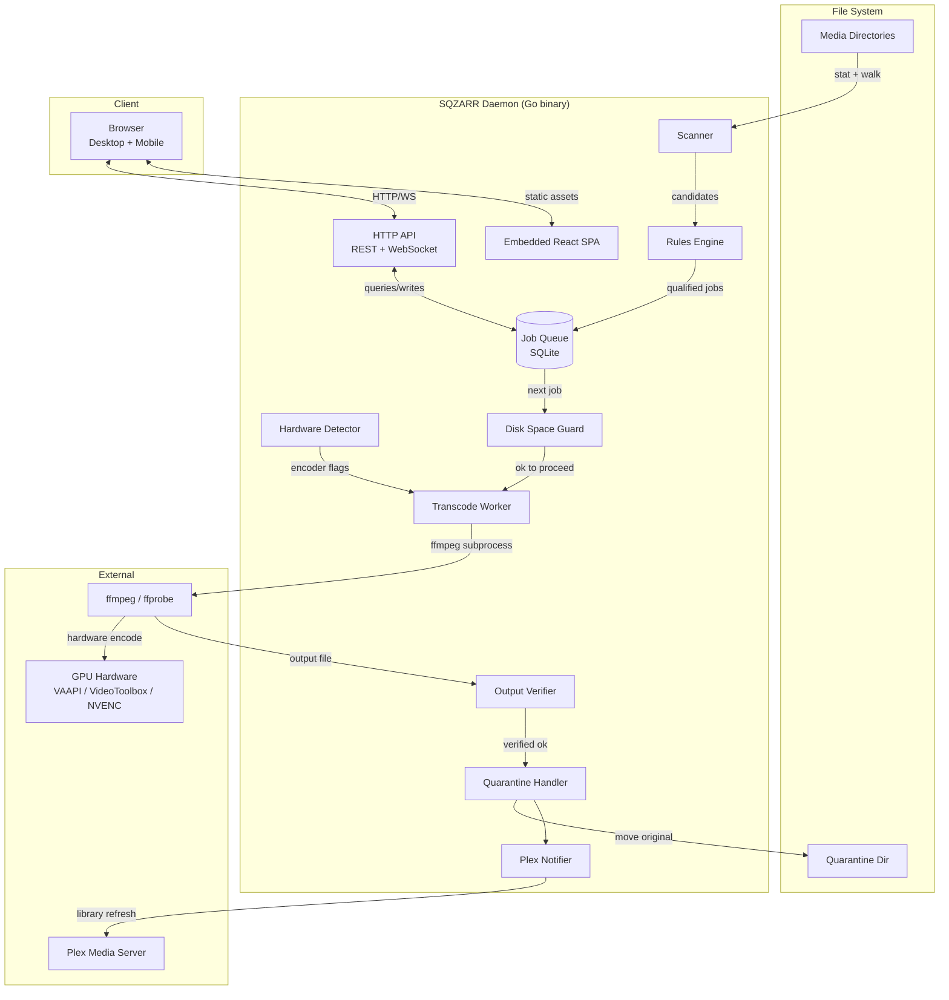

# SQZARR — Technical Architecture Document

## Executive Summary

SQZARR is a self-hosted media transcoding daemon with a React admin panel. It solves one problem: bloated video files on a NAS or home server that should be re-encoded to HEVC using available GPU hardware, safely and automatically, without any manual babysitting.

The system is a single Go binary (backend + embedded SPA) running as a native OS daemon. It uses SQLite for all persistent state. There is no network dependency, no cloud service, no container runtime. It runs on Linux LXC containers (Proxmox) and macOS natively.

Design priorities in order:
1. **Never corrupt or lose a file** — every other feature is subordinate to this
2. **Stay out of the way** — runs in background, doesn't eat disk, doesn't fail silently
3. **Look good** — ships polished, open-source-ready, sandstone palette, responsive

---

## System Overview



---

## Stack Decisions

### Backend: Go

**Choice**: Go 1.22+  
**Rationale**: Single self-contained binary with no runtime dependencies. Trivial cross-compilation to `linux/amd64`, `linux/arm64`, `darwin/arm64` (M4 Mac Mini). Strong standard library for HTTP, file I/O, and subprocess management. SQLite via `modernc.org/sqlite` (pure Go, no CGo required, simpler cross-compilation). The concurrency model (goroutines + channels) maps cleanly to a worker queue.  
**Tradeoffs**: Verbose compared to Python; slightly higher initial boilerplate. Accepted — the operational simplicity of a static binary is worth it.

### Frontend: React + Vite + TypeScript

**Choice**: React 18, Vite 5, TypeScript  
**Rationale**: Wide ecosystem, easy to produce a polished UI with available component libraries. TypeScript catches interface mismatches between frontend and API early. Vite is fast to develop with. The built SPA is embedded into the Go binary via `//go:embed`.  
**Tradeoffs**: Heavier than server-rendered HTML, but the user wants a responsive, live-updating dashboard — React's model is the right fit.

### Styling: Tailwind CSS + shadcn/ui

**Choice**: Tailwind CSS v3 + shadcn/ui component library  
**Rationale**: shadcn/ui provides accessible, unstyled-by-default components that we theme to the sandstone palette. No fighting an opinionated design system. Tailwind makes responsive layout straightforward.  
**Color palette**: Warm stone/sandstone tones. Primary: `stone-700` for text, `stone-100` for background, `amber-600` for accent/active states, `red-600` for errors. Dark mode: `stone-900` background.

### Database: SQLite

**Choice**: SQLite via `modernc.org/sqlite` (pure Go)  
**Rationale**: Zero external dependencies. Embedded in the binary. Perfect for a single-writer, low-concurrency local application. All persistent state (config, job queue, file history, quarantine records) fits in one file.  
**Tradeoffs**: Not suitable for multi-instance deployment — acceptable because SQZARR is explicitly single-instance.  
**Connection**: Single connection with WAL mode enabled. Write serialization via mutex in the data layer.

### Transcoding Engine: ffmpeg

**Choice**: System-installed `ffmpeg` + `ffprobe` on PATH  
**Rationale**: Proven, battle-tested. Supports all relevant hardware encoders via flags. Version-checked at startup. Not vendored — user installs it, standard on any home server.  
**ffmpeg encode flags by hardware**:
- VAAPI (Intel/AMD Linux): `-hwaccel vaapi -hwaccel_output_format vaapi -i INPUT -vf 'format=nv12,hwupload' -c:v hevc_vaapi -rc_mode CQP -qp 24 -c:a copy`
- VideoToolbox (Apple Silicon): `-c:v hevc_videotoolbox -q:v 65 -c:a copy`
- NVENC (NVIDIA): `-hwaccel cuda -c:v hevc_nvenc -preset p4 -cq 24 -c:a copy`
- Software fallback: `-c:v libx265 -crf 24 -preset medium -c:a copy`

### Process Management: systemd / launchd

**Choice**: Native OS service managers  
**Rationale**: No Docker. No container runtime. systemd on Linux (Debian/Ubuntu/Proxmox LXC), launchd on macOS. Install scripts provided for both. The binary handles its own signal handling (SIGTERM → drain current job → exit).

### Configuration: TOML file

**Choice**: TOML via `github.com/BurntSushi/toml`  
**Rationale**: Human-readable and -writable. No YAML indentation traps. Config is read at startup and can be reloaded via API or SIGHUP. The React UI writes config changes back via the API, which persists them to the TOML file.

---

## Data Model

```sql
-- SQLite schema for SQZARR

PRAGMA journal_mode = WAL;
PRAGMA foreign_keys = ON;

-- Watched directories and their rules
CREATE TABLE IF NOT EXISTS directories (
    id            INTEGER PRIMARY KEY AUTOINCREMENT,
    path          TEXT    NOT NULL UNIQUE,
    enabled       BOOLEAN NOT NULL DEFAULT 1,
    min_age_days  INTEGER NOT NULL DEFAULT 7,         -- skip files newer than this
    max_bitrate   INTEGER NOT NULL DEFAULT 1000000,   -- bits/sec; skip files below this
    min_size_mb   INTEGER NOT NULL DEFAULT 500,       -- skip files smaller than this
    -- codec excludes are global (HEVC, AV1 always skipped)
    created_at    DATETIME NOT NULL DEFAULT CURRENT_TIMESTAMP,
    updated_at    DATETIME NOT NULL DEFAULT CURRENT_TIMESTAMP
);

-- Transcode job queue
CREATE TABLE IF NOT EXISTS jobs (
    id              INTEGER PRIMARY KEY AUTOINCREMENT,
    directory_id    INTEGER REFERENCES directories(id),
    source_path     TEXT    NOT NULL,
    source_size     INTEGER NOT NULL,   -- bytes
    source_codec    TEXT    NOT NULL,
    source_duration REAL    NOT NULL,   -- seconds (from ffprobe)
    source_bitrate  INTEGER NOT NULL,   -- bits/sec
    output_path     TEXT,               -- temp path during transcode
    output_size     INTEGER,            -- bytes, set after verification
    output_codec    TEXT    NOT NULL DEFAULT 'hevc',
    encoder_used    TEXT,               -- vaapi/videotoolbox/nvenc/software
    status          TEXT    NOT NULL DEFAULT 'pending',
        -- pending | running | verifying | done | failed | skipped | cancelled
    priority        INTEGER NOT NULL DEFAULT 0,  -- higher = process sooner
    error_message   TEXT,
    progress        REAL    NOT NULL DEFAULT 0,  -- 0.0–1.0
    bytes_saved     INTEGER,                     -- source_size - output_size
    started_at      DATETIME,
    finished_at     DATETIME,
    created_at      DATETIME NOT NULL DEFAULT CURRENT_TIMESTAMP
);

CREATE INDEX IF NOT EXISTS idx_jobs_status ON jobs(status);
CREATE INDEX IF NOT EXISTS idx_jobs_source_path ON jobs(source_path);

-- Quarantine records: originals waiting for retention window to expire
CREATE TABLE IF NOT EXISTS quarantine (
    id              INTEGER PRIMARY KEY AUTOINCREMENT,
    job_id          INTEGER NOT NULL REFERENCES jobs(id),
    original_path   TEXT    NOT NULL,   -- where it was
    quarantine_path TEXT    NOT NULL,   -- where it is now
    expires_at      DATETIME NOT NULL,  -- delete original after this
    deleted_at      DATETIME,           -- null until GC runs
    created_at      DATETIME NOT NULL DEFAULT CURRENT_TIMESTAMP
);

-- Scan runs: audit log of each directory scan
CREATE TABLE IF NOT EXISTS scan_runs (
    id              INTEGER PRIMARY KEY AUTOINCREMENT,
    directory_id    INTEGER REFERENCES directories(id),
    files_scanned   INTEGER NOT NULL DEFAULT 0,
    files_queued    INTEGER NOT NULL DEFAULT 0,
    files_skipped   INTEGER NOT NULL DEFAULT 0,
    duration_ms     INTEGER,
    error           TEXT,
    started_at      DATETIME NOT NULL DEFAULT CURRENT_TIMESTAMP,
    finished_at     DATETIME
);

-- System stats: denormalized running totals for dashboard
CREATE TABLE IF NOT EXISTS stats (
    id                  INTEGER PRIMARY KEY CHECK (id = 1),  -- singleton row
    total_bytes_saved   INTEGER NOT NULL DEFAULT 0,
    total_jobs_done     INTEGER NOT NULL DEFAULT 0,
    total_jobs_failed   INTEGER NOT NULL DEFAULT 0,
    updated_at          DATETIME NOT NULL DEFAULT CURRENT_TIMESTAMP
);

INSERT OR IGNORE INTO stats (id) VALUES (1);

-- Application settings (key-value, for things not in TOML)
CREATE TABLE IF NOT EXISTS settings (
    key   TEXT PRIMARY KEY,
    value TEXT NOT NULL
);
```

---

## API Surface

All routes are under `/api/v1`. The React SPA is served from `/`.  
Authentication: optional Bearer token in `Authorization` header (if admin password is configured).

### System

| Method | Path | Description |
|--------|------|-------------|
| GET | `/api/v1/status` | Service status, hardware encoder detected, disk space, current job |
| GET | `/api/v1/stats` | Total bytes saved, jobs done/failed, uptime |
| POST | `/api/v1/scan` | Trigger an immediate scan of all enabled directories |
| GET | `/api/v1/hardware` | Detected hardware encoders and capabilities |

### Jobs

| Method | Path | Description |
|--------|------|-------------|
| GET | `/api/v1/jobs` | List jobs with pagination; filter by `status`, `directory_id` |
| GET | `/api/v1/jobs/:id` | Single job detail |
| POST | `/api/v1/jobs` | Manually enqueue a specific file path |
| POST | `/api/v1/jobs/:id/cancel` | Cancel a pending or running job |
| DELETE | `/api/v1/jobs/:id` | Remove a finished/failed job from history |
| GET | `/api/v1/jobs/current` | Currently running job with live progress |

### Directories

| Method | Path | Description |
|--------|------|-------------|
| GET | `/api/v1/directories` | List all configured directories |
| POST | `/api/v1/directories` | Add a directory |
| PUT | `/api/v1/directories/:id` | Update directory rules |
| DELETE | `/api/v1/directories/:id` | Remove a directory (does not delete files) |
| POST | `/api/v1/directories/:id/preview` | Dry-run: list files that would be queued |

### Quarantine

| Method | Path | Description |
|--------|------|-------------|
| GET | `/api/v1/quarantine` | List quarantined originals |
| POST | `/api/v1/quarantine/:id/restore` | Restore original, delete transcoded output |
| DELETE | `/api/v1/quarantine/:id` | Delete original now (don't wait for expiry) |

### Settings

| Method | Path | Description |
|--------|------|-------------|
| GET | `/api/v1/settings` | Get all settings |
| PUT | `/api/v1/settings` | Update settings (triggers config file write) |

### WebSocket

| Path | Description |
|------|-------------|
| `/api/v1/ws` | Pushes job progress updates, scan events, disk space alerts. JSON messages with `type` field: `job_progress`, `job_done`, `job_failed`, `scan_complete`, `disk_warning` |

---

## Authentication and Authorization

**Model**: Optional single-user password. If `auth.password_hash` is set in config, all `/api/v1` requests require a valid session token. The React login screen appears on first load if auth is configured.

**Implementation**:
- Password stored as bcrypt hash (cost 12) in TOML config
- Login endpoint: `POST /api/v1/auth/login` with `{"password": "..."}` → returns signed JWT (HS256, secret derived from password hash, 30-day expiry)
- JWT verified as Bearer token on all protected routes
- No refresh tokens — user logs in again after expiry
- No CSRF tokens needed — API is JSON-only, no form submissions

**Security hardening** (pre-publish checklist):
- All file paths validated against configured directory allowlist before any operation (prevent path traversal)
- Config file permissions: `chmod 600 sqzarr.toml`
- No secrets logged
- HTTP server binds to `127.0.0.1` by default (change to `0.0.0.0` for Tailscale access — documented)
- Rate limiting on auth endpoint: 5 attempts per minute per IP

---

## External Service Integrations

### ffmpeg / ffprobe

- Checked at startup: `ffmpeg -version` and `ffprobe -version`
- Version parsed; warn if below minimum tested version (6.0)
- ffprobe used for: detecting codec, calculating duration and bitrate pre-transcode; verifying output post-transcode

### Plex Media Server

- **Config**: `plex.base_url`, `plex.token` in TOML (optional)
- **Flow**: After successful file replacement, call `GET {base_url}/library/sections` to find the section containing the file path, then `GET {base_url}/library/sections/{id}/refresh`
- **Auth**: Plex uses `X-Plex-Token` header
- **Failure handling**: Log error, do not fail the job — Plex notification is best-effort

### Hardware Encoders

Probed once at startup, result cached:

```
1. Check for /dev/dri/renderD128 → run vainfo → if hevc_vaapi listed: use VAAPI
2. On Darwin: run ffmpeg -encoders | grep hevc_videotoolbox → if present: use VideoToolbox
3. Check nvidia-smi exit code → run ffmpeg -encoders | grep hevc_nvenc → if present: use NVENC
4. Fallback: software libx265
```

---

## Deployment Architecture

### Linux LXC (Proxmox)

```
Proxmox Host (pve2)
└── LXC Container (Debian 12, unprivileged)
    ├── /usr/local/bin/sqzarr          (the binary)
    ├── /etc/sqzarr/sqzarr.toml         (config)
    ├── /var/lib/sqzarr/sqzarr.db       (SQLite)
    ├── /var/log/sqzarr/               (log files)
    └── systemd: sqzarr.service

    Hardware passthrough:
    └── /dev/dri/renderD128           (Intel GPU via LXC device cgroup)
```

**systemd unit** (`/etc/systemd/system/sqzarr.service`):
```ini
[Unit]
Description=SQZARR Media Transcoder
After=network.target

[Service]
Type=simple
User=sqzarr
Group=sqzarr
ExecStart=/usr/local/bin/sqzarr serve --config /etc/sqzarr/sqzarr.toml
Restart=on-failure
RestartSec=10
StandardOutput=journal
StandardError=journal

[Install]
WantedBy=multi-user.target
```

### macOS (M4 Mac Mini)

```
macOS (Apple Silicon)
├── /usr/local/bin/sqzarr
├── ~/.config/sqzarr/sqzarr.toml
├── ~/Library/Application Support/sqzarr/sqzarr.db
└── launchd: ~/Library/LaunchAgents/com.sqzarr.agent.plist
```

**Install script**: `install-macos.sh` copies binary, creates config dir, installs plist, runs `launchctl bootstrap`.

### Build & Distribution

```
Makefile targets:
  make build-linux     → GOOS=linux GOARCH=amd64 go build ...
  make build-linux-arm → GOOS=linux GOARCH=arm64 go build ...
  make build-darwin    → GOOS=darwin GOARCH=arm64 go build ...
  make frontend        → cd frontend && npm run build → embeds into binary
  make release         → builds all targets, creates tarballs in dist/
```

GitHub Actions: on tag push, runs `make release`, creates GitHub Release with all binaries attached.

---

## Scaling Considerations

SQZARR is explicitly a single-instance, single-user application. It does not need to scale horizontally.

**Vertical scaling levers**:
- **Queue concurrency**: configurable `worker.concurrency` (default 1, max ~8 for multi-stream hardware)
- **Scan interval**: configurable, default 6 hours
- **ffmpeg preset**: more aggressive quality/speed trade-off for faster throughput

**File count**: SQLite handles hundreds of thousands of job history rows without issue. If scanning millions of files, scan run time increases linearly — acceptable.

**Future multi-machine**: not in scope. If needed, the right answer is multiple independent SQZARR instances on separate machines, not distributed coordination.

---

## Security Considerations

1. **Path traversal prevention**: All file operations validate the target path is within a configured directory. The API rejects any path containing `..` or symlinks pointing outside allowed roots.

2. **Command injection**: ffmpeg is invoked via `exec.Command` with explicit argument slices — never string interpolation into a shell command. File paths are passed as discrete arguments.

3. **Admin panel exposure**: Default bind address is `127.0.0.1:8080`. Users accessing via Tailscale must explicitly change to `0.0.0.0`. Documented prominently.

4. **Config file**: Contains the admin password hash and Plex token. `chmod 600` enforced by install script. Warn at startup if file is world-readable.

5. **ffmpeg subprocess**: Runs as the `sqzarr` service user, which should only have read access to media directories and write access to the quarantine directory. systemd `ProtectSystem=strict`, `ReadWritePaths=` restrict file system access.

6. **SQLite**: DB file should be owned by `sqzarr:sqzarr` with permissions `640`.

7. **Dependencies**: Go dependencies are pinned in `go.sum`. `npm audit` run in CI on the frontend. No network calls at runtime except optional Plex integration.

8. **Pre-publish security review checklist** (before GitHub release):
   - Run `gosec ./...` and address all HIGH/MEDIUM findings
   - Run `npm audit` on frontend, resolve criticals
   - Manual review of all file path handling code
   - Manual review of ffmpeg subprocess invocation
   - Verify no secrets are logged at any log level
   - Review README for security guidance (binding, password, Tailscale)

---

## Cost Model

**At rest** (daemon running, no active jobs):
- CPU: ~0% (sleeping goroutines, no polling)
- Memory: ~30–50 MB (Go runtime + SQLite in-memory cache)
- Disk: SQLite DB grows ~1 KB per completed job; negligible at hundreds of jobs

**Under load** (active transcode):
- CPU: near 0% (GPU doing the work via hardware encoder)
- GPU: 30–80% utilization depending on hardware and input
- Memory: ~100–200 MB (ffmpeg process)
- Disk write: up to `source_file_size` of temp space during transcode; this is the only meaningful resource concern
- Network: zero (all local)

**Initial backlog** (hundreds of files):
- Time: hardware transcode of typical 1080p episode (~45 min, 3–8 GB) takes 5–15 minutes wall clock on Intel Quick Sync
- Hundreds of files = days to weeks of background processing — by design
- Disk pressure: only one temp file at a time; Disk Space Guard prevents runaway usage

---

## Build Phases

### Phase 0 — Prerequisites (before writing code)
- [ ] Verify Intel VAAPI passthrough works in Proxmox LXC: `vainfo` returns `hevc_vaapi`
- [ ] Verify ffmpeg with VAAPI flags produces valid HEVC output from a test file
- [ ] Research Plex library refresh API endpoint and confirm it works with current Plex version
- [ ] Confirm `modernc.org/sqlite` cross-compiles cleanly for `linux/amd64` and `darwin/arm64`
- [ ] Set up GitHub repo with branch protection, Actions, and issue labels

### Phase 1 — Core Daemon (backend only, no UI)
- Go project structure: `cmd/sqzarr`, `internal/scanner`, `internal/transcoder`, `internal/db`, `internal/config`
- TOML config loading with validation
- SQLite schema migration on startup
- Directory scanner: walk, stat, ffprobe for codec/bitrate
- Rules engine evaluation
- Job queue with single worker
- ffmpeg invocation with hardware detection
- Output verification with ffprobe
- Atomic file replacement
- Structured JSON logging to stdout/file
- **Done when**: manually triggered scan finds files, transcodes one, replaces it, log shows all steps

### Phase 2 — File Safety
- Quarantine folder move after replacement
- Background GC for quarantine expiry
- Disk Space Guard: check free space before job start
- Restore-from-quarantine CLI command
- **Done when**: can corrupt a test output, confirm original is safe in quarantine; GC test deletes after timeout

### Phase 3 — HTTP API
- HTTP server with all REST endpoints
- WebSocket for live progress
- Optional JWT auth
- Path traversal validation
- **Done when**: `curl` against all endpoints returns correct data; WebSocket delivers progress events

### Phase 4 — React Admin Panel
- Vite project scaffold, Tailwind + shadcn/ui configured with sandstone palette
- Dashboard: system status, current job with progress, bytes saved, disk space indicator
- Queue page: pending jobs, cancel action, manual enqueue by path
- History page: completed/failed jobs with bytes saved per job
- Directories page: add/remove/configure directories, rules per directory, preview button
- Settings page: hardware info, scan interval, quarantine settings, Plex config, optional password
- Embed SPA into Go binary with `go:embed`
- **Done when**: full user flow works end-to-end in browser on desktop and mobile viewport

### Phase 5 — Plex Integration + macOS Support
- Plex library section detection and rescan call
- launchd plist and macOS install script
- Test on M4 Mac Mini with VideoToolbox
- **Done when**: file transcoded on macOS, Plex library refreshes automatically

### Phase 6 — Polish + Pre-Release
- `gosec` and `npm audit` clean
- Manual security review of all file path handling
- README with full setup instructions for Proxmox LXC and macOS
- GitHub Actions: build all targets, attach to release on tag
- Smoke test script
- **Done when**: dogfood on production library for 1 week with no errors, then publish to GitHub
